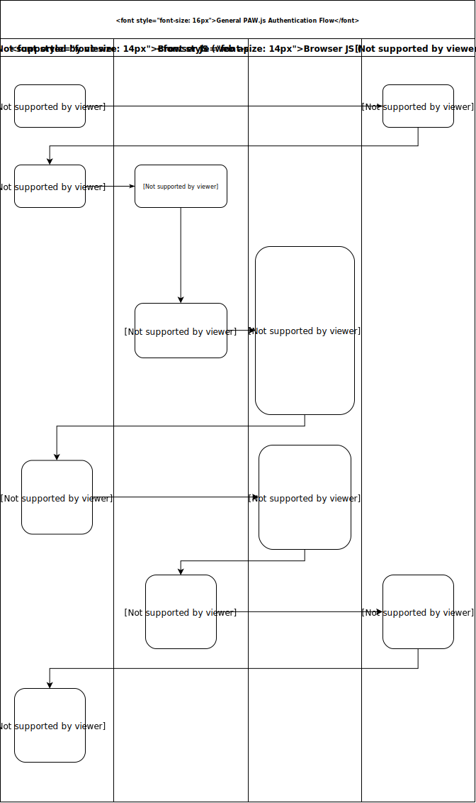

# Passwordless Authentication Wallet (PAW)
PAW.js is key-based authentication for the web. The library helps manage identities, their associated public/private keypairs, and signing operations in the browser. The goal is to solve a few problems:

## Password reuse
Have you ever reused a password? Has an account of yours ever been [compromised in a data breach](https://haveibeenpwned.com/)?

PAW.js generates a new keypair for each account/identity, and so there's no need for concern if the service is compromised since each key is unique and it only stores the user's public key fingerprint.

## Convenience and UX
Signup page password policies are often a poor experience. Login flows aren't much better when you have to remember the *unique* credentials you signed up with. You could use a password manager for this, but good luck with the mobile experience.

With PAW, users and organizations no longer have to deal with [password complexity rules/policies](https://www.owasp.org/index.php/Authentication_Cheat_Sheet#Implement_Proper_Password_Strength_Controls). The UX is simply two clicks to login or signup. That's it.

## Phishing
Not aware that you've been sent to the wrong site? Not to worry with PAW because it uses `postMessage`'s safety of unforgeable origins.

In PAW, identities are separated by origin. This means if the user visited malicious phishing site A and it requested the user to authenticate using PAW, PAW wouldn't load site B's keypairs because it cannot forge the origin sent in the `postMessage` authentication request. Therefore, the user can't be tricked into signing in with any of site B's accounts.

# How it works

# Demo

demo link TODO
demo code TODO

# How to use
Store PAW on separate origin (preferably static assets only) or use existing PAW. The most secure option would have PAW running on a localhost origin. See below for some examples.

## Your webapp
~~~
var walletwindow;
var wallet= "http://localhost:8000";

function showlogin() {
  walletwindow = window.open(wallet);

  var myinterval = setInterval(function () {
    console.log("trying to send hello");
    try {
      walletwindow.postMessage("PAW_auth", wallet);
      clearInterval(myinterval);
    }
    catch (err) {
      console.log(err);
    }
  }, 600);

  window.addEventListener("message", this.messagehandler );

}

function messagehandler(message) {
  console.log(message.source);
  console.log(message.origin);
  console.log(message.data);

  if (message.origin === wallet) {
    // send it to the web app backend to validate
    fetch(window.origin + "/auth", {
      body: JSON.stringify(message.data), // must match 'Content-Type' header
      cache: 'no-cache', no-cache, reload, force-cache, only-if-cached
      credentials: 'same-origin',
      headers: {
        'content-type': 'application/json'
      },
      method: 'POST',
    }).then(function(response) {
      console.log(response);
      window.location.reload();
    }).catch(function(error) {
      console.log('There has been a problem with your fetch operation: ', error.message);
    });
  }
  window.removeEventListener("message", this.messagehandler);
}

~~~

## Your custom PAW origin

### Init
`window.paw = new PAW(messagecb, {debug: false});`

### Signup

~~~
window.paw.create(<identity>, function(ids) {
  console.log("new identity created: " + ids);
  window.paw.sign_for_operation("signup", <identity>, function (postbackmessage) {
    window.paw.send(postbackmessage, function (err, errmsg) {
      if (!err) {
        console.log("status is good");
        window.close();
      }
    });
  });
});
~~~

### Get all identities for the requesting origin
~~~
window.paw.get_identities(function(event) {
  console.log(event.target.result);
});
~~~

### Login
~~~
window.paw.sign_for_operation("login", <identity>, function (postbackmessage) {
  window.paw.send(postbackmessage, function (err, errmsg) {
    if (!err) {
      console.log("status is good");
      window.close();
    }
  });
});
~~~

# FAQ

## Miss your password?
Currently, PAW uses webcrypto which does not support encrypted private keys. It's on the future roadmap to support NaCl-based encrypted private keys and thus that would require a password.

## What about XSS?
The whole purpose of hosting PAW on a separate origin with only static assets is to mitigate XSS issues. If an XSS were to occur on the web app origin, the PAW origin impact would be less severe since the user would still be required to "approve" a login or signup request via clicking.

Also, since PAW is based on webcrypto, if the PAW origin were to somehow be affected by XSS, private keys are set to non-extractable meaning that the attacker could use signing operations of the private keys, but they wouldn't be able to read/access the them.

## Why webcrypto?
It's [well supported](https://caniuse.com/#feat=cryptography) and has [non-extractable keys](https://developer.mozilla.org/en-US/docs/Web/API/SubtleCrypto/exportKey).

 Webcrypto doesn't have the best public key algorithms support, so the future roadmap is to include an option for NaCl.

## Why host on separate origin?
See [What about XSS?](#what-about-xss)

## Managing keys across multiple devices/browsers?
Most folks have more than one device or use more than one browser.

A couple of options I can think of (I'm sure there's more):
* PAW via an app that keeps keys synchronized across devices.
* Extract, copy, then import the keypair.
* Web app supports multiple keys tied to an account via a key approval process.

It's on the roadmap to have support for and example demos for each.

## What would a key reset flow look like?
It should look almost identical to current password reset flows, but instead it's keys.

# License
This project is licensed under the BSD License - see the [LICENSE](LICENSE) file for details
